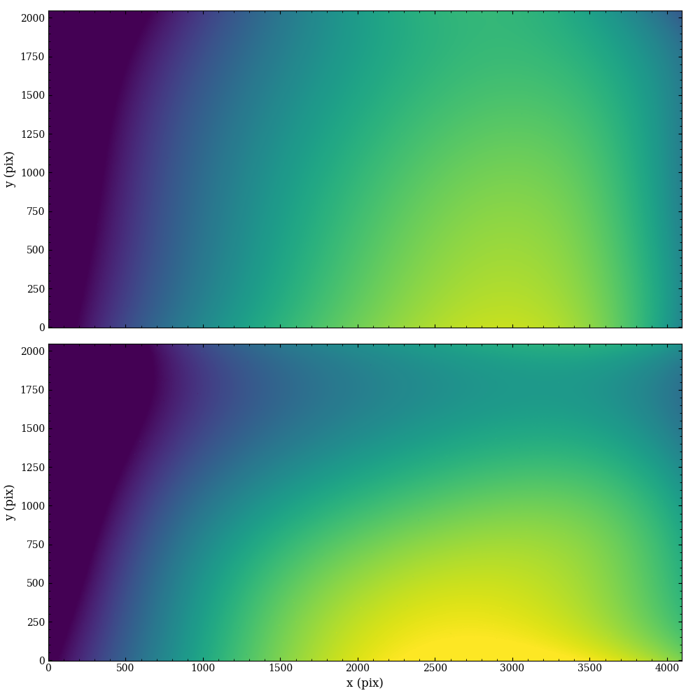

Background Subtraction
======================

Introduction
------------

The background in a slitless spectroscopic image is generally far more
complex than the equivalent for standard imaging, despite likely
having the same background SED(s).  This occurs because each patch of
sky acts as an emitting source and projects its spectrum onto the
detector.  However, the detector records the sum over all the patches
for every spectral order, and since each order has a unique response
function, there is a nontrivial *shape* in the background of a
two-dimensional slitless image.  This shape is further complicated by
the limited distance from the detector that a patch can be and still
project light (of any order) onto the detector, which often arises
from the finite size of the pick-off mirror (POM) or other optical
element.  A final confounding issue is that each pixel in the detector
likely has a unique, wavelength-dependent flat field, which further
modulates the effective brightness from the sky.

   The smoothed master sky image for the Advanced Camera for Surveys (ACS)
   G800L grating.

Master Sky Subtraction
----------------------

Given the issues inherent in the sky background for wide-field
slitless spectroscopy summarized above, the canonical approach to
separating this signal from the astrophysical sources of interest is
the use of a *master-sky image*.  Here many science and calibration
exposures have been aggregated and combined in a way to remove the
sources, and provide a clean image of the sky background.  Therefore
the present task is to scale this sky image such that it matches the
sky pixels in a :math:`{\chi}^2`-sense.  For a single sky image, this
multiplicative scaling is given by:

.. math::
   \alpha = \frac{\sum_{i,j} w_{i,j} I_{i,j} S_{i,j}}{\sum_{i,j} w_{i,j} S_{i,j} S_{i,j}}

where :math:`i,j` refer to pixel positions, :math:`w_{i,j}`, :math:`I_{i,j}`,
and :math:`S_{i,j}` represent the pixel weights (more on this below),
wide-field slitless image, and master-sky image, respectively.  Therefore
sky-subtracted slitless image will be given by

.. math::
   S'_{i,j} = \alpha S_{i,j}.

For a Gaussian likelihood function, the pixel weight are given as the
inverse of the uncertainties squared: :math:`w_{i,j}=U_{i,j}^{-2}`.
However, many pixels are known to be bad for various reasons, which is
encoded in the data-quality arrays (DQAs).  Therefore, we including an
additional binary weighting factor (:math:`d_{i,j}`) that is unity for
pixels with no data-quality bits set.  There are two additional
effects that must be included to determine :math:`\alpha`.

Object Masking
^^^^^^^^^^^^^^

The presence of the spectra from astrophysical sources complicates the
estimation of the scaling parameter, and so they must be masked [#f1]_.
In principle, the automatic detection and masking of source spectra could
be done in a number of ways, but `slitlessutils` implements an
iterative approach of comparing between a notional scaled background
image and the data.

The `slitlessutils` algorithm for masking objects is:

#. Initialize the background model as a constant value determined from a
   sigma-clipped median, while masking known bad pixels.

#. Estimate the optimal scaling parameter :math:`\alpha` from the above
   expression.

#. Flag pixels in the object weights by setting pixels in :math:`d_{i,j}`
   with
   
   .. math::
      \left|I_{i,j}-\alpha S_{i,j}\right| > n_{sig} U_{i,j}
    
   where :math:`n_{sig}` is a number of sigma for sources.

#. Go to step 2.  Repeat until either a maximum number of iterations is
   reached or the fractional change in :math:`\alpha` is below a
   convergence threshold :math:`\epsilon`:
   
   .. math::
      \left|(\alpha^{(i+1)} - \alpha^{(i)}\right| \leq \epsilon \alpha^{(i+1)}
   
#. Use the optimized scaling parameter to compute the sky-subtracted
   science frame as :math:`I_{i,j}-\alpha S_{i,j}`.

At this point there are two things worth mentioning.  Firstly, there
are effectively two parameters that govern the master-sky subtraction:
:math:`n_{sig}` and :math:`\epsilon` that control the sigma clipping
for sources and convergence tolerance, respectively.  Secondly, while
the foremost goal was to determine the sky background level, a useful
byproduct is the updated object model :math:`d_{i,j}`, which is saved
by default to a file named :code:`f"{base}_src.fits"`.

Example
^^^^^^^
   
Here we show a quick example to use the master-sky subtraction for a
single grism exposure given by the filename :code:`grismfile`:

.. code:: python
	  
   import slitlessutils as su

   # not totally necessary, but this will engage the slitlessutils logger
   su.start_logging()

   # perform the master sky subtraction on the filename "grismfile"
   su.core.preprocess.background.mastersky(grismfile, inplace=True)

This will update the file in place, as the flag is set: :code:`inplace=True`,
but will additionally write a :code:`f"{base}_src.fits"` file to disk.
	

Column-Based Refinement
-----------------------
Not yet implemented.

Special Notes for WFC3/IR
-------------------------

The above description is for a single-component sky-background
spectrum.  However, the infrared channel in the Wide-Field Camera 3
(WFC3) instrument on HST is known to exhibit multiple spectral
components.  `Pirzkal & Ryan (2020)
<https://www.stsci.edu/files/live/sites/www/files/home/hst/instrumentation/wfc3/documentation/instrument-science-reports-isrs/_documents/2020/WFC3_IR_2020-04.pdf>`_
the background image for each spectral component for each infrared
grism.  These multiple components should be used with the
`WFC3_Back_Sub <https://github.com/NorPirzkal/WFC3_Back_Sub>`_ utility
available by N. Pirzkal on github, as these ideas are not subsumed
into `slitlessutils`.  In brief, this requires starting with the *RAW*
files for the grism data, and processing for each visit (WFC3_Back_Sub
will group the data by visit).

.. rubric:: Footnotes
.. [#f1] For our present purposes, we do not need to distinguish between
	 genuine astrophysical sources or spectral traces and cosmic rays.
	 However for future analyses (such as spectral extraction), this
	 distinction will become important.  See `the documentation
	 on cosmic rays <cosmicrays.rst>`_ for more information.	 

