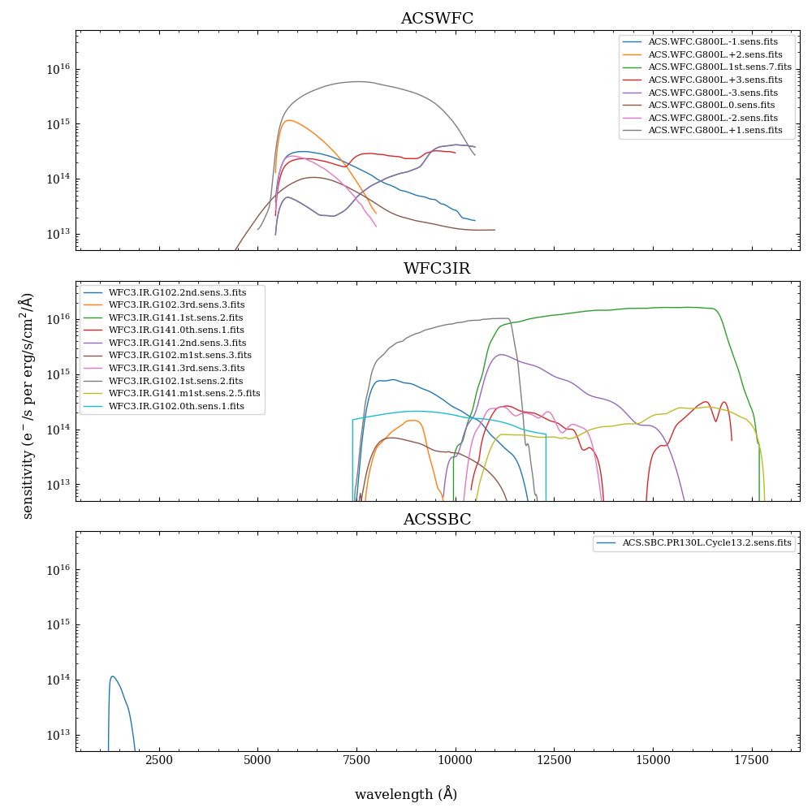

.. _calib:

Calibrations for WFSS
=====================

The calibration files for ``slitlessutils`` are staged on a centralized box repository, which can be accessed using the :class:`~slitlessutils.Config` object.  For more information, please see `the configuration documentation <configure>`_.  

Spectral Specification
----------------------

To extract or simulate WFSS data, we must specify the `Spectral Trace`_  and the `Spectral Dispersion`_, which are each given as parametric curves (as described in `Pirzkal and Ryan 2017 <https://www.stsci.edu/files/live/sites/www/files/home/hst/instrumentation/wfc3/documentation/instrument-science-reports-isrs/_documents/2017/WFC3-2017-01.pdf>`_). In brief, here a parameter: :math:`0 \leq t \leq 1` describes the :math:`(x_s(t), y_s(t),\lambda(t))`.  However, these functions can vary within the field-of-view, which is parametrized by the :term:`undispersed position` :math:`(x_0,y_0)`.  

Spectral Trace
^^^^^^^^^^^^^^
The :term:`spectral trace` describes the position of the spectrum on the detector(s).  The relative position of the spectral trace is given as a polynomial in the parameter:

.. math::
	\tilde{x}(t;x_0,y_0) = a_0(x_0,y_0) + a_1(x_0,y_0)t + a_2(x_0,y_0)t^2 + ...
	\tilde{y}(t;x_0,y_0) = b_0(x_0,y_0) + b_1(x_0,y_0)t + b_2(x_0,y_0)t^2 + ...

However, the spectral element may be rotated with respect to the calibration observations, and therefore, requires introducing a small rotation matrix.  Now the position in the spectroscopic image will be:

.. math::
	x_s(t;x_0,y_0,\theta) = x_0 + \cos(\theta)\tilde{x}(t;x_0,y_0)} - \sin(\theta)\tilde{y}(t;x_0,y_0)} + \Delta x
	y_s(t;x_0,y_0,\theta) = y_0 + \sin(\theta)\tilde{x}(t;x_0,y_0)} + \cos(\theta)\tilde{y}(t;x_0,y_0)} + \Delta y

where :math:`(\Delta x, \Delta y)` are the :term:`wedge offsets`.

Spectral Dispersion
^^^^^^^^^^^^^^^^^^^
The :term:`spectral dispersion` describes the wavelength along the spectral trace.  The spectral dispersion of a :term:`grism` element is often constant with wavelength, which corresponds to a linear (or low-order polynomial) in the parameter:

.. math::
	\lambda(t;x_0,y_0) = \alpha_0(x_0,y_0) + \alpha_1(x_0,y_0)t + \alpha_2(x_0,y_0)t^2 + ...

which will be given by a :class:`~slitlessutils.core.wfss.config.StandardPolynomial`.  However, :term:`prism` elements often exhibit a dispersion that is highly non-linear (as a function of wavelength), which can be described as a `Laurent polynomial <https://mathworld.wolfram.com/LaurentPolynomial.html>`_ (e.g. `Bohlin et al 2000 <https://www.stsci.edu/files/live/sites/www/files/home/hst/instrumentation/acs/documentation/instrument-science-reports-isrs/_documents/isr0001.pdf>`_):

.. math::
	\lambda(t;x_0,y_0) = \alpha_0(x_0,y_0) + \frac{\alpha_1(x_0,y_0)}{(t-t^*(x_0,y_0))} + \frac{\alpha_2(x_0,y_0)}{(t-t^*(x_0,y_0))^2} + \frac{\alpha_3(x_0,y_0)}{(t-t^*(x_0,y_0))^3} + ...

This introduces an additional parameter :math:`t^*` that effectively modulates the non-linearity (e.g. )

:class:`~slitlessutils.core.wfss.config.ReciprocalPolynomial`

.. note::
	This formulation of the spectral trace and dispersion differs from what was used by `aXe <https://hstaxe.readthedocs.io/en/latest/>`_, which effectively employed the path length along the trace as the parameter.  However, this formulation is more computationally efficient with no loss in accuracy.  

Field-Dependence
^^^^^^^^^^^^^^^^

As noted above, the coefficients in the trace and dispersion polynomials can be polynomials of the undispersed positions:

.. math::
	\kappa(x_0,y_0) = \kappa_{0,0} + \kappa_{1,0}x_0 + \kappa_{0,1}y_0 + \kappa_{2,0}x_0^2 + \kappa_{1,1}x_0y_0 + \kappa_{0,2}y^0^2 + ...

where :math:`\kappa` can be any of the elements of :math:`a, b, \alpha` or :math:`t^*` (for the prism dispersion). These spatial polynomials are specified by :class:`~slitlessutils.core.wfss.config.SpatialPolynomial` and are of fixed total order :math:`n`.  This implies the number of any set of these coefficients will be a `triangular number <https://en.wikipedia.org/wiki/Triangular_number>`_ and serialized with `Cantor pairing <https://en.wikipedia.org/wiki/Pairing_function>`_.  

.. note::
	In all above cases, the coefficients :math:`{a}, {b}, {\alpha}` will be unique for each spectral order, 
	must be determined from calibration observations, and 

Usual Workflow
^^^^^^^^^^^^^^

Since ``slitlessutils`` is largely predicated forward-modeling the WFSS data, the usual workflow begins with a known direct image position and assumed wavelength, then the WFSS image position can be found by:

#. Use the world-coordinate system (WCS) to transform from the direct image position to the *undispersed position* in the WFSS image.  
#. Invert the spectral dispersion to find the parameter (:math:`t`).
#. Evaluate the spectral trace with the parameter (:math:`t`).

.. note::
	For linear dispersion models, this inversion can be done analytically.  For higher-order polynomials, ``slitlessutils`` inverts using `Halleys Method <https://en.wikipedia.org/wiki/Halley%27s_method>`_.

Flat Field
----------

The flat-field corrects for differences in the pixel-to-pixel sensitivity, and is derived by observing a suitably flat illumination pattern.  Importantly, this correction is wavelength-dependent, but the wavelength covered by a WFSS image pixel will depend on the *undispersed position* :math:`(x_0,y_0)`.  Therefore, the WFSS images are not flat-fielded by the calibration pipelines, and so it must be accounted for in the extraction/simulation processes.  ``Slitlessutils`` implements the wavelength-dependent flat field as a polynomial in wavelength:

.. math::
	{\cal F}(x,y,\lambda) = \sum_k {\cal F}(x,y)\left(w(\lambda))^k

where 

.. math::
	w(\lambda) = \left\{\begin{array{ll}
	0 & \text{for } \lambda<\lambda_0 \\
	\frac{\lambda-\lambda_0}{\lambda_1-\lambda_0} & \text{for } \lambda_0\leq\lambda\leq\lambda_1 \\
	0 & \text{for } \lambda_1<\lambda\end{array}}\right.

and the parameters :math:`\lambda_0, \lambda_1` are the lower and upper bounds (respectively) for which the flat-field cube is defined. Additionally, users may also specify a *gray flat* (typically derived from a direct image flat field) or a unity flat (effectively ignoring the flat-field correction entirely).  See:

* Unity flat field: :class :`~slitlessutils.core.wfss.config.UnityFlatField`
* Gray flat field: :class :`~slitlessutils.core.wfss.config.ImageFlatField`
* Polynomial flat field: :class :`~slitlessutils.core.wfss.config.PolynomialFlatField`
* factory function to load these: :func:`~slitlessutils.core.wfss.config.load_flatfield()`

Sensitivity Curves
------------------

Conversion between :math:`e^-`/s and :math:`erg/s/cm^2/s`.

   The sensitivity curves for the ACS/WFC, WFC3/IR, and ACS/SBC instruments.

