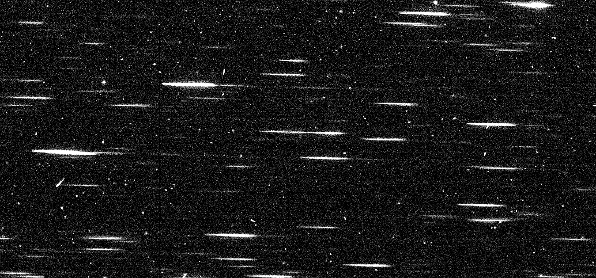

.. _cosmicrays:

Cosmic Rays
===========

Introduction
------------

:term:`Cosmic rays (CRs)<cosmic ray>` are high energy particles that may often impart a large amount of charge that is unpredictable and has a characteristically sharp spatial profile.  For the multiaccum infrared detectors, the up-the-ramp sampling can flag the overwhelming majority of these events and populate the :term:`data-quality arrays (DQAs)<data-quality array>`, the CCDs do not have any analogous flagging algorithms.  In this case, there are effectively two options for identifying pixels that

#. deviate by some threshold between independent exposures; or

#. have the sharp spatial profile.

The former method is the canonical approach for standard imaging, but for WFSS data, this approach gets additionally complicated. At present, `slitlessutils` has tools to flag pixels based on the profile shapes.

.. note::
   Slitlessutils does not interpolate over cosmic rays, instead it assumes the data-quality array has been updated to reflect this pixel does not contain valid data.

Edge Detection with Laplacians
------------------------------

Detecting sharp edges in imaging has long been a subject of computer vision research, and one common technique is to identify regions where the flux distribution (:math:`I`) changes concavity.  This can be achieved by finding where the second derivative goes to zero, and the second derivative is given as the Laplacian:

.. math::
   \nabla^2 I = \frac{\partial^2 I}{\partial x^2}+\frac{\partial^2 I}{\partial y^2}.

For a pixelated light distribution, the Laplacian must be extended for finite differences, which is an approximation to the continuous case.  One such approximation is given by:

.. math::
   \nabla^2 I_{x,y} \approx \frac{I_{x+h,y}+I_{x-h,y}-4\,I_{x,y}+I_{x,y-h}+I_{x,y+h}}{h^2}

and for :math:`h=1`, this expression is concisely given as a simple image convolution :math:`\nabla^2 I \approx K \ast I`.  `slitlessutils` offers several forms for the Laplacian covolution kernel:

.. math::
   
   K_{3a} = \left(\begin{array}{rrr}  0 & -1 &  0 \\
   -1 & +4 & -1 \\
    0 & -1 &  0 \end{array}\right)

   K_{3b} = \left(\begin{array}{rrr} -1 & -1 & -1 \\
   -1 & +8 & -1 \\
   -1 & -1 &  -1 \end{array}\right)

   K_{3c} = \left(\begin{array}{rrr} +1 & -2 & +1 \\
   -2 & +4 & -2 \\
   +1 & -2 & +1 \end{array}\right)

   K_{5a} = \left(\begin{array}{rrrrr}  0 &  0 & -1 &  0 &  0 \\
    0 & -1 & -2 & -1 &  0 \\
   -1 & -2 & +16 & -2 & -1 \\
    0 & -1 & -2 & -1 &  0 \\
    0 &  0 & -1 &  0 &  0 \end{array}\right)

where :math:`K_{3a}` is the kernel for the approximation [#f1]_.  After convolving the image with the Laplacian kernel, pixels that deviate more than :math:`n` times above their respective uncertainties (:math:`U`) are considered as candidate CR pixels:

.. math::
   \left|\nabla^2 I\right| \geq n\, U

These candidate pixels are grouped based on their connectivity (see `skimage.measure.label()`) and only groups with a minimum number of pixels are kept.  Finally, the remaining groups can be grown using standard dilation operations (see `skimage.morphology.dilation() <https://scikit-image.org/docs/stable/api/skimage.morphology.html#skimage.morphology.dilation>`_), and several different footprints (`square`, `rectangle`, `diamond`, `disk`, `octagon`, and `star` --- see the respective functions in `skimage.morphology`).

Example
~~~~~~~
    
This are the kernels and can be envoked by the subscript, for example

.. code:: python
   	  
   import slitlessutils as su

   # not totally necessary, but this will engage the slitlessutils logger
   su.start_logging()

   # perform the master sky subtraction on the filename "grismfile"
   su.core.preprocess.crrej.laplace(grismfile, kernel='3a', inplace=True)

This will update the file in place, as the flag is set: :code:`inplace=True`.  See :numref:`animatedcrs` for an animation of how cosmic rays appear and then can be bilinearly-interpolated over.

.. _animatedcrs:

   Example of cosmic-ray flagging from convolution from a Laplacian kernel and bilinear interpolation to highlight the differences.

      
AstroDrizzle Cosmic Ray flagging
--------------------------------

Since CRs are stochastic events and are uncorrelated between adjacent exposures, then comparing successive images to some combination from those images (such as average or median) will show pixels that deviate by more than some threshold.  However, the WFSS images are often dithered with respect to each other and have a non-negligible amount of image distortion, making the naive comparison impossible.  The standard technique with :term:`direct imaging` is to use the ``AstroDrizzle`` package from the `drizzlepac software <https://drizzlepac.readthedocs.io/en/latest/>`_ to correct for the image dithers and distortion, apply the cosmic-ray flagging thresholds, and produce an stacked image can be extended to WFSS data.  However, the WFSS data brings a new challenge, namely the :doc:`sky background <background>` is not uniform, and AstroDrizzle cannot address these backgrounds.  Therefore, the sky background must be removed before AstroDrizzle can be considered.

One can directly call AstroDrizzle, however additional care must be taken in selecting the exposures for drizzle combination.  Specifically, data taken at different orients will result a different arrangement of spectral traces, despite the underlying scene not changing.  This differing arrangement of spectral traces will be erroneously flagged as cosmic-rays by AstroDrizzle, and produce highly unreliable results.  Therefore, **it is essential that only images taken at the same orient are passed to AstroDrizzle**.  To assist in this, ``slitlessutils`` has the capability of pre-grouping the WFSS data before processing with AstroDrizzle, the options are:

* **group by visit:** Since images in a given visit often have the same orient, only mosaicking data from a given visit will ensure the data are at the same orient, but may have only a few exposures (see also :func:`slitlessutils.core.preprocess.crrej.drizzle.group_by_visit()`)

* **group by position angle:** This explicitly groups the images by the position angle, however this is a floating-point variable, which requires a matching tolerance.  (see also :func:`slitlessutils.core.preprocess.crrej.group_by_position_angle()`)

These grouping mechanisms can be called directly, or used in the high level routine :func:`slitlessutils.core.preprocess.crrej.drizzle_grouped_files()` that has an optional argument ``grouping`` that can take values ``visit`` or ``position_angle``.

.. note::
   AstroDrizzle will produce a stacked WFSS image, which is not used for any scientific calculation.  However, these data can be useful as a quicklook data product.

Examples
~~~~~~~~

.. code:: python

   import slitlessutils as su

   # the filenames of entire collection of WFSS images
   wfssfiles = ['wfssfile1_flt.fits', 'wfssfile2_flt.fits', 'wfssfile3_flt.fits']

   # FIRST, we should perform background subtraction
   for wfssfile in wfssfiles:
      su.core.preprocess.background.mastersky(wfssfile, inplace=True)

   # group images by VISIT before processing
   su.core.preprocess.crrej.drizzle_grouped_files(wfssfiles, grouping='visit')

   # group images by POSITION ANGLE before processing
   su.core.preprocess.crrej.drizzle_grouped_files(wfssfiles, grouping='position_angle')

.. rubric:: Footnotes
.. [#f1] It is worth mentioning that Laplacian kernels must share the
	 property that :math:`\sum_{i,j}K_{i,j}=0`.

