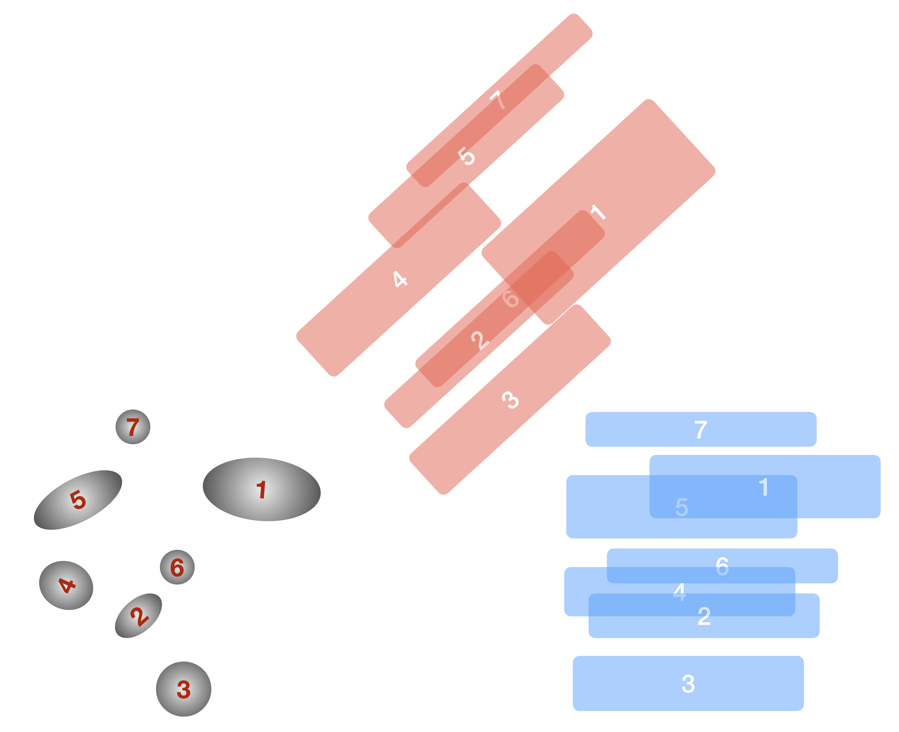

.. _groupingalgorithm:

Source Grouping (`~slitlessutils.modules.Group()`)
==================================================

The :doc:`multi` method uses a forward model to determine the weights that describe the linear operator that transforms between the incident, astrophysical signal (in physical units) to the pixelated observation recorded by the detector (in instrumental units).  As shown in `Ryan, Casertano, & Pirzkal (2018) <https://ui.adsabs.harvard.edu/abs/2018PASP..130c4501R/abstract>`_, this linear system is often very sparse, where typically 99.99% of the elements are identically zero.  Therefore `specialized libraries <https://docs.scipy.org/doc/scipy/reference/sparse.html>`_ for describing and solving sparse systems can be used to tackle otherwise computationally intractable problems.  Still, the computational requirements can be further improved by reducing the scale of the problem by only considering the sources that overlap.

.. _groupingfigure:

   An illustration of the :term:`grouping` methodology.  In the grayscale, we show a hypothetical direct image scene, with the source numbers indicated in red.  We show two position angles: :math:`\theta=0^\circ` (blue) and :math:`\theta=42^\circ` (red).

In :numref:`groupingfigure`, we show the methodology for identifying distinct groups.  In the :math:`\theta=0^\circ` position angle (blue), there are four distinct groups, based on their overlaps: {{7}, {1, 5}, {2, 4, 6}, {3}}.  On the other hand, at :math:`\theta=42^\circ` (red), there are now three distinct groups: {{4, 5, 7}, {1, 2, 6}, {3}}.  Therefore for the total contamination is given by the combination of these two groups: {{1, 2, 4, 5, 6, 7}, {3}}, which can be solved sequentially.  These calculations are implemented using `NetworkX <https://networkx.org/en/>`_, where each object is represented as a :term:`node` and objects that overlap in the dispersed image are connected with edges.  For the purposes of defining overlaps in the grouping algorithm, we take the ratio of the intersection of the two regions to their union:

.. math::

   w_{i,j} = \frac{A(S_i\cap S_j)}{A(S_i\cup S_j)}.

This ratio is used as a weight in the in the `networkx.Graph()`.  Below we show an example of the graphing for just the blue position angle (left), the red position angle (middle), and the combination (right).  Here the thickness of the edge represents the maximum of the fractional areas (given above) while the color of the node indicates the (approximate) apparent magnitude of the object.

.. _graphs:
.. list-table:: The connected graphs for the blue orient (left), red orient (middle), and the combined dataset (right).  
   :width: 100%
   :widths: 33 33 33
   :class: borderless

   * - .. image:: g1.png
         :width: 100%
         :alt: Graph for the blue orient.

     - .. image:: g2.png
         :width: 100%
         :alt: Graph for the red orient.

     - .. image:: gcomb.png
         :width: 100%
         :alt: Graph for the combined dataset.

.. note::
   The apparent magnitudes are simply labeled in the graph to highlight the constrast ratio between sources, and are not used in any weighting.

Example
-------
.. code:: python
	  
	  from slitlessutils.core.modules.group import GroupCollection

	  # make an empty collection
	  g1 = GroupCollection()

	  # add the objects
	  g1.add_object(1, 19)
	  g1.add_object(2, 20)
	  g1.add_object(3, 21)
	  g1.add_object(4, 22)
	  g1.add_object(5, 23)
	  g1.add_object(6, 23)
	  g1.add_object(7, 24)

	  # add contamination as edges
	  g1.add_contamination(1, 5, 0.35)

	  g1.add_contamination(2, 4, 0.25)
	  g1.add_contamination(4, 6, 0.2)

	  # make a plot
	  g1.plot(filename='g1.png', minobj=1)
	  

To Group or Not to Group?
-------------------------
Although grouping is designed to reduce the computing requirements, in particular the RAM and CPU usage, it is not always beneficial.  For example, a scene and observational geometry that results in many, uncontaminated sources may actually require longer runtime (but still reduce the RAM usage).   This happens because the total time required to make the matrix for each group separately (ie. the time to build one matrix times the number of independent groups) becomes longer than the runtime for solving the equivalent problem with a single group.

.. tip:: 
   Users are encouraged to perform the grouping and plot the network graph to get a sense of the number of distinct, disconnected groups.  For this, consider the `GroupCollection.plot()` function and checking the size of a given `GroupCollection` using the `len()` function.

