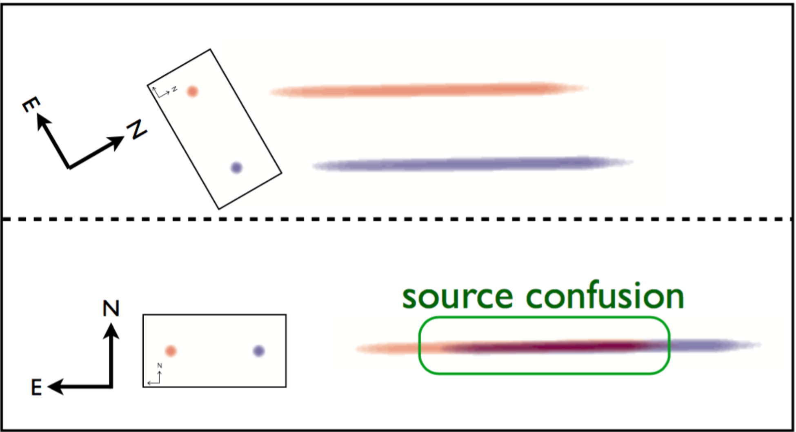

.. _multi:

Multi-Orient Extraction (`~slitlessutils.modules.extract.multi`)
================================================================

The multi-orient extraction was first developed by `Ryan, Casertano, & Pirzkal (2018) <https://ui.adsabs.harvard.edu/abs/2018PASP..130c4501R/abstract>`_ and referred to as *LINEAR*.  This method was founded to address the :term:`contamination` (or confusion) from overlapping spectral traces, where the detector records a weighted sum of the the spectra (see :numref:`confusion` below).  Therefore, this represents a fundamental degeneracy, which can only be broken with additional data.  The :doc:`single-orient extraction <single>` formalism uses the broadband data to inform the :term:`contamination model`, whereas the *LINEAR* uses data at multiple orients provide a self-consistent, spectroscopic model for the entire scene.

.. _confusion:

   An illustration of spectral contamination or confusion (taken from `Ryan, Casertano, & Pirzkal 2018 <https://ui.adsabs.harvard.edu/abs/2018PASP..130c4501R/abstract>`_).  Along the left side of each panel, they show a red and blue point source whose celestial positions are fixed (as shown the coordinate vane).  This shows that under certain orients (lower panel), the spectra will overlap leading to the spectral degeneracy.  However, if the telescope is reoriented, then the spectral traces separate, which provides the leverage to break this degeneracy.

Although the formative effort was to break the degeneracy from contamination/confusion, additional advantages were identified. Namely, the spectral resolution of a WFSS mode, is set by properties of the grating and the size of the source.  In analogy to the relationship between slit width and spectral resolution for long-slit spectroscopy, the size of the source projected along the dispersion axis set the resolution --- where the larger the source, the lower the resolution.  Therefore, simply averaging spectra extracted at separate orients (such as described in :doc:`single-orient extraction <single>`) will result in biases, when the resolutions are different (which most often occurs for extended sources).  Hence, one can either smooth all the data to a common resolution before averaging (which loses spectral resolution) or analyze the high-resolution data by itself (which loses signal-to-noise).  But `Ryan, Casertano, & Pirzkal (2018) <https://ui.adsabs.harvard.edu/abs/2018PASP..130c4501R/abstract>`_ find that the *LINEAR* method recovers the highest spectral resolution present in the data, at the cost of an increased computational resources and collecting data at multiple orients.

Mathematical Formulation
------------------------

The *LINEAR* framework acknowledges that the flux in a WFSS image pixel is the sum of all sources and wavelengths, weighted by factors related to the sources (e.g. the cross-dispersion profiles) and the detector (e.g. :doc:`sensitivity curve, flat-field <calib>`, or :doc:`pixel-area map <simulation>`):

.. math::

   S_{x,y,i} = \sum_{l}\sum_{k=1}^{N_\mathrm{obj}} W_{x,y,i,l,k}\, f_{l,k}

where :math:`i` refers to the :math:`i^{\rm th}` WFSS image in the collection.  The known and unknown indices are grouped together with `np.ravel_multi_index() <https://numpy.org/doc/stable/reference/generated/numpy.ravel_multi_index.html>`_ as:

.. math::

   \begin{eqnarray}
      \vartheta &=& x + n_x\,y+ n_x\,n_y\,i\\
      \varphi &=& l + n_l\,k
   \end{eqnarray}

respectively.  Now the above double sum is recast as a simple matrix equation:

.. math::

   S_{\vartheta} = \sum_\varphi W_{\vartheta,\varphi}\, f_{\varphi}.

But since this is an overconstrained problem, then the vector of unknowns :math:`f_{\varphi}` must be solved with optimization techniques:

.. math::

   \chi^2\left(f_\varphi\right) = \sum_{\vartheta} \left(\frac{S_{\vartheta} - \sum_{\varphi} W_{\vartheta,\varphi}\,f_{\varphi}}{U_{\vartheta}}\right)^2

which is simplified by subsuming the WFSS uncertainties into the data and linear operator as:

.. math::

   \begin{eqnarray}
      S_{\vartheta} &\rightarrow& \frac{I_{\vartheta}}{U_{\vartheta}}\\
      W_{\vartheta,\varphi} &\rightarrow& \frac{W_{\vartheta,\varphi}}{U_{\vartheta}}
   \end{eqnarray}

so that now :math:`\chi^2(f) = ||I - W\,f||^2`.  Although this can be directly solved, the poor condition number of :math:`W` can amplify the input noise into the output result, which can be ameliorated by including a `regularization term <https://en.wikipedia.org/wiki/Ridge_regression>`_.  Additionally, for most WFSS observations, the linear operator :math:`W` will be extremely sparse, which permits specialized techniques to iteratively compute the unknown vector :math:`f_{\varphi}` without computing the pseudo-inverse of :math:`W`.  However, `Ryan, Casertano, & Pirzkal (2018) <https://ui.adsabs.harvard.edu/abs/2018PASP..130c4501R/abstract>`_ re-frame the regularization term so that the :term:`regularization parameter` becomes dimensionless.

.. math::

   \psi^2(f) = \chi^2(f) + \ell\,\xi^2(f)

where :math:`\ell` is the :term:`regularization parameter` and the *regularization term* is

.. math::

   \xi^2\left(f_\varphi\right) = ||W||_F^2\,\sum_\varphi\left(f_{\varphi}-f_{\varphi}^{(0)}\right)^2

with :math:`||W||_F` is the `Frobenius norm <https://en.wikipedia.org/wiki/Matrix_norm>`_ and :math:`f_{\varphi}^{(0)}` is the :term:`damping target`, which is initialized from the broadband data.  Now the goal is to find the vector :math:`f_\varphi` that minimizes :math:`\psi^2`.

The Role of the Damping Target
^^^^^^^^^^^^^^^^^^^^^^^^^^^^^^

The :term:`damping target` predominately controls how the spectra behave near the edges of the WFSS :term:`sensitivity curve`.  The default behavior is to have no damping target, which is effectively assuming a damping of zero: :math:`f_{\varphi}^{(0)}=0`, and will tend to produce spectra that "go to zero".  This is likely unphysical and not one generally expects.  However if the damping target is set to something reasonable, such as the broadband photometry, then the linear-reconstruction algorithm will tend to that spectrum.  In :numref:`dampingtarget`, we show an example of this using a source with a flat spectrum: :math:`f_{\lambda}=0.03\times10^{-17} \mathrm{erg}/\mathrm{s}/\mathrm{cm}^2/\mathrm{Å}`.  

.. _dampingtarget:
.. figure:: images/target.pdf
   :align: center
   :alt: Effect of damping target.

   Example of the role of the :term:`damping target`.  The true spectrum is shown as a solid black line (taken to be a constant of :math:`\sim0.034` erg/s/cm:math:`^2`/Å), and the extractions with no damping target (blue) and a constant equal to the broadband flux (red).  The light gray region shows the throughput curve of the G102 grism on WFC3/IR.  The solver algorithms will attempt to extrapolate the spectrum equal to the damping target, therefore the "no-damping target" case (blue) will tend to zero.  On the other hand, the damping target set to the broadband photometry (red) will tend to that value, which will produce spectra that better match the photometry.  **Note: the y-axis values are in units of :math:`10^{-17}`.  

Notes on the Uncertainties
^^^^^^^^^^^^^^^^^^^^^^^^^^

Based on the above mathematical formulation, the linear-reconstruction methods will produce uncertainties as the diagonals of the matrix: 

.. math::
   u_{\varphi} = \sqrt{\left(W^\mathrm{T}W+\ell^2||W_F||^2\right)^-1}

However, the propagation of uncertainties that accounts for only the detector/astrophysical effects should come from the diagonal elements of :math:`\sqrt{\left(W^\mathrm{T}W\right)^{-1}}` (ie. :math:`\ell=0`).  Therefore for :math:`\ell\neq0`, the uncertainties will be underestimated.  

.. warning::
   The uncertainties produced in the linear-reconstruction method are generally underestimated.  Future releases will implement a Markov-Chain Monte Carlo (MCMC) method to give more realistic uncertainties.

.. _matrix:

Sparse Linear-Operator Construction
-----------------------------------

Coming Soon.

.. _solutions:

Sparse Least-Squares Solution
-----------------------------

There have been several algorithms devised to find the vector :math:`f_{\varphi}` that minimizes the cost function for :math:`\psi^2`, and many have been implemented into the `scipy sparse solvers <https://docs.scipy.org/doc/scipy/reference/sparse.linalg.html#module-scipy.sparse.linalg>`_.  However, ``slitlessutils`` is only organized to work with the two most common methods:

* **LSQR:** first presented by `Paige & Saunders (1982) <https://dl.acm.org/doi/10.1145/355984.355989>`_, is the standard tool for these types of linear systems.  See also the scipy implementation of `LSQR <https://docs.scipy.org/doc/scipy/reference/generated/scipy.sparse.linalg.lsqr.html>`_
* **LSMR:** later developed by `Fong & Saunders (2011) <https://arxiv.org/abs/1006.0758>`_, and improves upon LSQR by generally converging faster.  See also the scipy implementation of `LSMR <https://docs.scipy.org/doc/scipy/reference/generated/scipy.sparse.linalg.lsmr.html>`_.

.. warning::
   Based on experimentation with the *LINEAR* work, the LSQR solver generally yields better results at increased CPU costs.  Therefore, it is set as the default sparse least-squares solver.

.. _regularization:

Regularization Optimization
---------------------------

As discussed above, the regularized least-squares introduces a tunable parameter that trades between modeling the data (ie. the :math:`\chi^2`-term) and damping the high frequency noise present in inverse problems (ie. the :math:`\xi^2`-term).  However, there have been heuristic approaches at "optimizing" the :term:`regularization parameter` :math:`\ell`, and the most common method is to consider a plot of :math:`\log\xi^2` versus :math:`\log\chi^2`, which often called the "L-curve" as it shows a characteristic sharp resembling a capital-L (see :numref:`lcurveexample`).  It is accepted that the vertex of the L is represents a good compromise, and so there are several techniques to honing in on this critical point. In broad terms, these methods all rely on some aspect of the finding the point of maximum curvature[#curvefoot]_ (lower panel of :numref:`lcurveexample`) along the parametric curve (upper panel of :numref:`lcurveexample`).  ``Slitlessutils`` offers three options for identifying this critical point:

#. **Single-value:** Accept a single value of the :term:`regularization parameter`, and return the vector :math:`f_{\varphi}`.
#. **Brute-force search:** Define a linear grid of :math:`\ell`, compute the curvature[#curvefoot]_ at all points, and return the value of :math:`f_{\varphi}` that is associated with the maximizing value of :math:`\ell`.
#. **Golden-ratio search:** `Cultrerra & Callegaro <https://ui.adsabs.harvard.edu/abs/2020IOPSN...1b5004C/abstract>`_ present a method based on subdividing the search space by various factors of the `golden ratio <https://en.wikipedia.org/wiki/Golden_ratio>`_ to minimize unnecessary calls to the sparse least-squares solver and use fewer steps than a brute-force approach.

.. note::
   The Golden search method converges the fastest and produces the best results, and so it is set as the default regularization optimizer.

.. _lcurveexample:
.. figure:: images/starfield_multi_lcv.pdf
   :align: center
   :alt: Example regularization plot.

   The top panel shows the standard L-curve with the scaling factor of the Frobenius norm to ensure that the :term:`regularization parameter` :math:`\ell` is dimensionless, which is encoded in the color of the plot symbols (see colorbar at the very bottom).  The lower panel shows the curvature[#curvefoot]_ as a function of the log of the (dimensionless) :term:`regularization parameter`.  The clear peak at :math:`\log\ell\sim-1.9` represents the sharp vertex in the L-curve at :math:`(\log\chi^2,\log\xi^2)\sim(2.1,3.6)`.  This point is adopted as it represents a roughly "equal" compromise between modeling the data (ie. the :\math:`\chi^2`-term) and damping high-frequency structure (ie. the :math:`\xi^2`-term).  This plot was made using the grid-based search with :math:`\Delta\log\ell=0.1`.

Grouping
--------

As framed above, the multi-orient extraction simultaneously solves for the spectra for entire collection of sources, which depending on the number of sources and/or number of wavelength elements, can result in quite sizeable linear operators.  Obviously this would require significant computing resources, something that may not be available.  Therefore, ``slitlessutils`` has a *grouping* submodule that will group any spectral traces that overlap in all combinations of the WFSS data together, and these groups can be considered "atomic" problems that can be sequentially solved with significantly less computing resources.  This can be thought of as block diagonalizing this sparse operator into chunks that are also sparse systems.  See the :doc:`Grouping Module <grouping>` for more details.

Example
-------

Coming Soon.

.. rubric:: Footnotes
.. [#curvefoot] The curvature is adopted as the `Menger curvature <https://en.wikipedia.org/wiki/Menger_curvature>`_.
