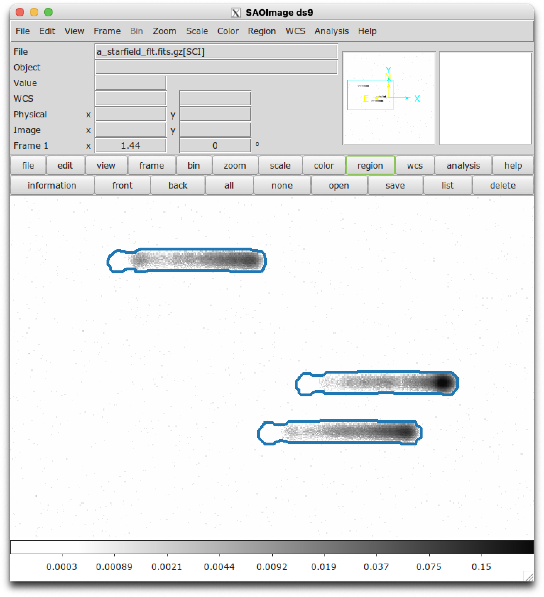

.. _regions:

Regions Files for ``ds9`` (`~slitlessutils.modules.Region()`)
=============================================================

It is occasionally useful to render the two-dimensional WFSS image with spectral traces marked.  For this, ``slitlessutils`` has the ability to distill the PDT files into a `ds9 <https://sites.google.com/cfa.harvard.edu/saoimageds9>`_ region file using the module :class:`slitlessutils.modules.Region()`.

To determine the outline of a spectral source in a WFSS image, one should load the images (``WFSSCollection()``) and sources (``SourceCollection()``), and then ``slitlessutils`` will:

* For every WFSS image:

	* For every detector in the WFSS image:

		* For every source:

			* For every spectral order in question:

				#. load the PDTs for all of the :term:`direct imaging` pixels associated with the source
				#. :term:`decimate<decimation>` over wavelength
				#. make temporary mask with 1 for any pixel present in the decimated PDT
				#. apply a *binary closing* morphological operator from `skimage.ndimage <https://docs.scipy.org/doc/scipy/reference/generated/scipy.ndimage.binary_closing.html>`_ with a square kernel, whose size is set in the :class:`slitlessutils.modules.Region()` object
				#. find the contours for a highly-connected binary image using `scikit-image <https://scikit-image.org/docs/stable/api/skimage.measure.html#skimage.measure.find_contours>`_ as a closed polygon
				#. write the polygon into the region file as a ``ds9`` `polygon regions <https://ds9.si.edu/doc/ref/region.html>`_

	* Write the region file to disk.

* Output a separate ``ds9`` regions file for each WFSS file and detector combination.

The resulting regions will have their title as the segmentation ID and the spectral order will encoded by the color of the region.  ``Slitlessutils`` assumes the ``tab20`` colormap from `matplotlib <https://matplotlib.org/stable/tutorials/colors/colormaps.html>`_, where the bold colors are for positive orders, pastel colors are for negative orders, and the zeroth order will be white (see :numref:`tab20` below).  The region filename will be the WFSS image filename with the detector name appended.  In :numref:`regionsexample` we show an example of the first-order traces highlighted.  

.. _tab20:
.. figure:: images/ordercolors.pdf
	:align: center
	:alt: Spectral order colors

	The colors used for spectral orders (indicated as text labels).  The bold/pastel colors refer to positive/negative orders, respectively.  The zeroth order will be illustrated as white.

Example
-------

.. code:: python

	import slitlessutils as su

	# load the WFSS data
	data = su.wfss.WFSSCollection.from_glob('*.fits.gz')

	# load the sources
	sources = su.sources.SourceCollection(segfile, imgfile)

	# instantiate the region module
	reg = su.modules.Region(ncpu=1, close_size=12)

	# run the module
	regfiles = reg(data, sources)

.. _regionsexample:

   The grayscale image shows the ``slitlessutils`` simulation of three Gaussian point sources observed with the ACS/SBC (PR130L).  The blue polygons show the regions derived for this scene using ``slitlessutils``.
