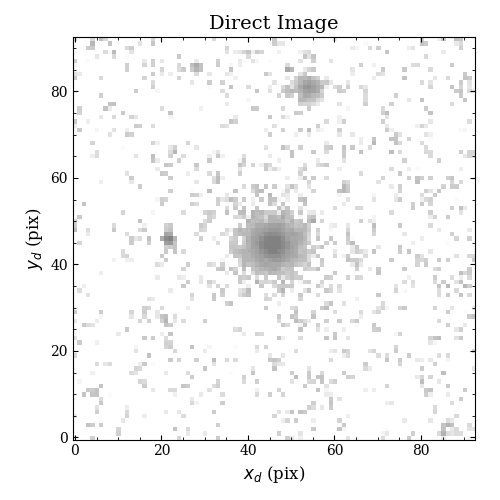
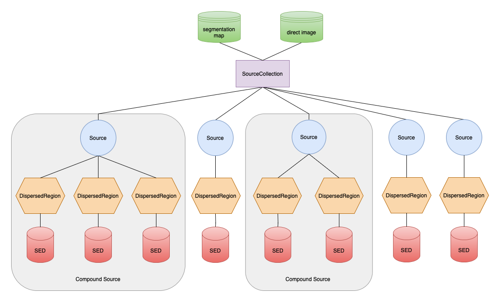

.. _sources:

Spectroscopic Sources
=====================

Source (`~slitlessutils.sources.Source()`)
------------------------------------------

A :term:`source` is defined as a single region on the sky that will be considered for processing by the :doc:`modules <modules>`.  A source is only instantiated from two-dimensional images that represent  the :term:`direct image<direct imaging>` and :term:`segmentation map` (see :numref:`segmapexample` below).  The segmentation map describes the direct-image pixels that belong to the source, and so in the most basic terms, a source is the set of direct-image pixels:

.. math::
	\mathbb{S} = \left\{(x_1, y_1), (x_2,y_2), (x_3, y_3), ..., (x_n, y_n)\right\}

The direct image establishes weights that will be used for the cross-dispersion profile and metadata for the source (e.g. barycenter, brightness with local-sky subtraction, etc.).  While these images may be determined from any filter, the best results will be when it is from the same camera and its transmission is contained within the spectroscopic bandpass (e.g. as F140W is to G141 for WFC3/IR).

In addition to the metadata mentioned above, a source also describes the spectrum that is either the assumed or measured, in the case of :doc:`simulation <simulation>` or :doc:`extraction <extraction>`, respectively.  However, in either case, **source may contain multiple spectra** by decomposing a source into multiple :term:`dispersed regions<dispersed region>` (more below).  A dispersed region is defined as a unique subset of the source pixels (denoted as :math:`\mathbb{S}_i` for the :math:`i^\mathrm{th}` dispersed region) and is associated with a unique spectrum.  Thus, the union of all dispersed regions is the same as the source set (:math:`\mathbb{S}=\bigcup_i\mathbb{S}_i`).  If a source contains a single dispersed region it is said to be a :term:`simple source`, which is contrast to a :term:`compound source` that contains many distinct spectral regions.

.. note::
	Given increased (self-)contamination associated with a compound source, it can only be extracted if multiple orients are available and the :func:`sliltessutils.core.modules.extract.multi.Multi()` is used.  Additionally, care should be taken to avoid overly subdividing a source such that there are more "unknowns" than "knowns".

Since a source may contain multiple dispersed regions, the :func:`slitlessutils.core.sources.Source()` inherits from ``list``, which iterates over the dispersed regions.

.. _segmapexample:

	Illustration of the direct image and segmentation map.  The colored regions indicate different sources, which would all be instantiated in the ``SourceCollection`` object.

Dispersed Region (`~slitlessutils.sources.DispersedRegion()`)
^^^^^^^^^^^^^^^^^^^^^^^^^^^^^^^^^^^^^^^^^^^^^^^^^^^^^^^^^^^^^

As stated above, a :term:`dispersed region` is defined as the unique subset of direct-image pixels that have the same spectrum, which is stored as an ``slitlessutils.core.photometry.SED`` object.  Importantly, the ``SED`` object contains the usual data one expects for a spectrum (e.g. wavelength, flux, uncertainty, etc.) and the ``DispersedRegion`` object must contain additional metadata, including the direct-image pixels, the :term:`source ID`, and the :term:`region ID`.  By construction, every source has a unique :term:`source ID`: ``segid``, but each of its constituent ``DispersedRegion``\s will be assigned a :term:`region ID`: ``regid``.  However, the ``regid`` always counts from 0 for each source, therefore the tuple ``(segid, regid)`` uniquely specifies an :term:`sed ID`.

Source Collection (`~slitlessutils.sources.SourceCollection()`)
---------------------------------------------------------------

This is the primary data structure that users will interact with, which is meant to mimic the structure of the ``WFSSCollection`` (see the :doc:`spectroscopy documentation<wfss>`), that inherits from ``dict`` where the keys will be the :term:`source ID` and the values will be instances of the ``Source``.  In typical usage, one will instantiate a single ``SourceCollection``, which will be passed to any of the :doc:`computational modules <modules>`.

These definitions establish a *hierarchy*, where a ``SourceCollection`` (likely) contains many ``Source``\s that (potentially) contain many ``DispersedRegion``\s that (typically) contain many spectral elements (ie. wavelengths, fluxes, and uncertainties).  This hierarchy is shown schematically in :numref:`hierarchy`, with the any :term:`compound source` highlighted in gray.

.. _hierarchy:

	Schematic representation of the source/spectra hierarchy with the primary inputs (segmentation map and direct image) shown.  A ``SourceCollection`` (purple box) is the primary way to instantiate a ``Source`` (blue circles), which contain any number of ``DispersedRegion``\s (orange hexagons) that each contain one ``SED`` (red cylinder).  A :term:`compound source` is highlighted in gray.

Again, the inputs are a :term:`direct image<direct imaging>` and :term:`segmentation map`, and :numref:`segmapexample` shows an example of these data, however there are several keyword-arguments that control aspects of the source instantiation.

.. _sourcekwargs:
.. list-table:: Keyword Arguments
   :header-rows: 1
   :stub-columns: 0
   :width: 600

   * - Keyword
     - Datatype
     - Description
   * - ``maglim``
     - ``float`` or ``int``
     - | The magnitude limit for valid sources, which must be *brighter* than this. Default is ``np.inf``.
   * - ``minpix``
     - ``int``
     - | The minimum number of direct-image pixels for a source to be consider valid. Default is 0.
   * - ``zeropoint``
     - ``float`` or ``int``
     - | The magnitude AB zeropoint for the :term:`direct image<direct imaging>`.
   * - ``throughput``
     - | ``None``, ``str``, or
       | ``slitlessutils.core.photometry.Throughput``
     - A description of the filter curve (more below).
   * - ``sedfile``
     - ``str``
     - | The filename to an multi-extension fits file 
       | that contains the SEDs (more below).

The keywords ``maglim`` and ``minpix`` are used to eliminate spurious sources before they are added to the collection.  The final two keyword arguments (``throughput`` and ``sedfile``) **are only used when simulating a scene** and establish the throughput curve associated with the direct image and a file that contains the SEDs to be associated with each ``DispersedRegion``, respectively.

Rules for Ascribing the ``Throughput``
^^^^^^^^^^^^^^^^^^^^^^^^^^^^^^^^^^^^^^

The ``throughput`` variable described in the above table is needed to normalize the SEDs to match the aperture photometry derived from the direct image, therefore it is **essential that this curve overlap with the spectral element**.  Additionally, the ``throughput`` variable can take many different types, which affect how the object will be loaded:

If the ``throughput`` is a:
	* ``slitlessutils.core.photometry.Throughput``: return that;
	* ``str``: assume this is the full path to the throughput file, so load that;
	* any other type:
	
		* if ``FILTFILE`` is in the header, load that;
		* if keywords ``TELESCOP``, ``INSTRUME``, and ``FILTER`` exist and indicate a valid throughput file in the :file:`$HOME/.slitlessutils/<VERSION>/bandpasses/` directory, which contains several common bandpasses used with the WFC3 and ACS instruments.  These files are also fits files and have the name: ``<TELESCOP>_<INSTURME>_<FILTER>.fits``.  These files can also contain the zeropoint, based on the header keyword ``ZERO``.  Users can obtain any throughput for HST instruments using `synphot <https://synphot.readthedocs.io/en/latest/>`_, but should inspect the packaged files to understand the necessary formatting of the file.

.. note::
	**Ascii-Formatted Throughput Curves:**	If loading a user-specified, ascii-formatted throughput curve, then it is assumed to be space-delimited columns of wavelength and transmission, which are units of angstroms and dimensionless, respectively.

Notes on the Photometric Zeropoint
^^^^^^^^^^^^^^^^^^^^^^^^^^^^^^^^^^

The AB magnitude zeropoint is needed for two reasons:

	#. ``slitlessutils`` measures the aperture magnitude with a simple, local background subtraction, which allows the user to reject sources that are too faint; and/or
	#. when simulating, the source spectra are normalized to match these aperture magnitudes.

Description of the ``sedfile``
^^^^^^^^^^^^^^^^^^^^^^^^^^^^^^

The ``sedfile`` is a ``str`` representing the full path to a multi-extension fits (MEF) file that contains either the one-dimensional spectra or the filename (and path) to the spectra.   Each extension refers to a different spectrum, which is encoded by the ``EXTNAME`` and ``EXTVER`` keywords for the ``SEGID`` and ``REGID``, respectively.  If the extension is a valid ``astropy.io.fits.BinTableHDU``, then the ``data`` attribute is used to load the spectrum.  If not, then the full path to a spectrum is looked in the ``FILENAME`` header keyword.  The ``sedfile`` variable instantiates a ``slitlessutils.core.sources.SEDFile()`` object, which behaves like a file object (to facilitate file-context management) and a ``dict`` (to facilitate object indexing):

.. code:: python

	import slitlessutils as su

	with su.core.sources.SEDFile(sedfile) as seds:

		# load the spectrum for (segid,regid)=(3,1)
		this_sed = seds[3]

		# load the spectrum for (segid,regid) = (4,2)
		new_sed = seds[(4,2)]

In both cases, ``this_sed`` and ``new_sed`` in the previous example will be ``slitlessutils.core.photometry.SED`` objects.  The indices will be either a single ``int`` to load a single spectrum for the ``regid==1`` (the default for a :term:`simple source`) or a ``tuple`` to load a given combination of (segid,regid).   Lastly, the if the header for a given extension contains the keyword ``REDSHIFT``, then the spectra will be redshifted by adjusting the wavelength elements: :math:`\lambda\rightarrow\lambda\,(1+z)`.

.. note::
	Currently only flat-segmentation maps are supported, therefore all instantiated sources will be :term:`simple sources<simple source>`.  This will be remediated soon.

Notes on Extraction Parameters
^^^^^^^^^^^^^^^^^^^^^^^^^^^^^^

The default extraction parameters are specified in the :doc:`instrument YAML files <instrumentfiles>`, which will differ between a :term:`grism` and :term:`prism`.  However, they can be programmatically changed at any of the level of the above hierarchy, and will be propagated to all of its children levels.

Example
^^^^^^^
.. code:: python

	import slitlessutils as su

	# parse segmentation map and direct image into sources in a source collection
	sources = su.sources.SourceCollection(segmentation_filename, directimage_filename)

	# reset the extraction parameters for all sources
	sources.set_spectral_parameters(lamb0=9000., lamb1=12000.)

	# or adjust for a single source
	sources[1].set_spectral_parameters(lamb0=5000.)

Again, there are several keyword arguments that control key aspects of the source initialization (see :numref:`sourcekwargs`).
