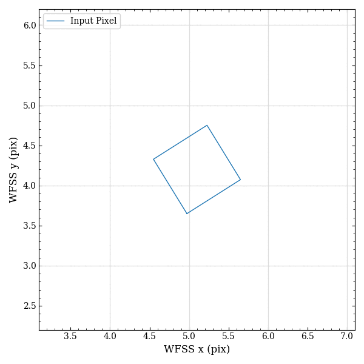

.. _tabulation:

Tabulation in ``slitlessutils``
===============================

The most computationally expensive aspect of extracting or simulating WFSS observations comes from the forward-modeling every (relevant) pixel in the :term:`direct imaging`.  Therefore, ``slitlessutils`` only performs these calculations when requested and stores these intermediate results as a :term:`pixel-dispersion table` (PDT).  

* For each WFSS file:
	- For each detector in the WFSS file:
		> For each source in the source collection:
			+ For each :term:`direct imaging` pixel :math:`(x_d,y_d)` in the source:
				#. convert the direct imaging pixel to the :term:`undispersed position` :math:`(x_0,y_0)` using the WCS information for both images
				#. For each spectral order:
					#. For each tabulation wavelength (see :ref:`The tabulation wavelengths` below):
						#. convert wavelength into parameter :math:`t` using the inverse of the dispersion relation
						#. evaluate the trace at the parameter :math:`t`
						#. compute fractional pixel area (see :numref:`animatedpixel` below)
						#. record an entry in the PDT as :math:`(x, y, l, a)`, where :math:`a` is the fractional pixel area that the :term:`direct imaging` pixel :math:`(x_d,y_d)` projects onto the WFSS image pixel :math:`(x,y)` at the wavelength index :math:`l` [#wavefoot]_.

.. note:: The tabulation wavelengths
	This is some text. his is some text. his is some text. his is some text. his is some text. his is some text. his is some text. his is some text. his is some text. his is some text. his is some text. his is some text. 

	.. math::
		\lambda(l) = \lambda_0 + \left(\lambda_1-\lambda_0\right)\frac{l}{N-1}

	his is some text. his is some text. his is some text. his is some text. his is some text. his is some text. his is some text. his is some text. 

.. _animatedpixel:

   Dispersed pixel and fractional area calculations.  ``Slitlessutils`` uses `pypolyclip <https://github.com/spacetelescope/pypolyclip>`_ to compute fractional pixel area on a dispersed image pixel grid (shown by colored polygons).  The known area of the input polygon (shown in blue) is :math:`0.64 \mathrm{pix}^2`.  

Given the hierarchical nature outlined in the above algorithm, the PDTs are stored as `hierarchical data-format 5 (HDF5) <https://www.hdfgroup.org/solutions/hdf5/>`_ and then can be viewed or manually edited with standard tools (e.g. `HDFView <https://www.hdfgroup.org/downloads/hdfview/>`_).  Now the process of extraction or simulation will begin by aggregating the PDTs from the appropriate :term:`direct imaging` pixels and spectral order, and summing over unique triplets :math:`(x,y,l)`.

which requires *raveling* these three indices into a single index:

.. math:: 
	i = x + n_x\,y + n_x\,n_y\,l

where :math:`(n_x,n_y)` represents the dimensionality of the WFSS image.  

.. rubric:: Footnotes
.. [#wavefoot] For tabulating sources, we assume a linear sampling of the wavelength :math:`\lambda`, and use :math:`l` to refer to the *index* in this linear sampling.  